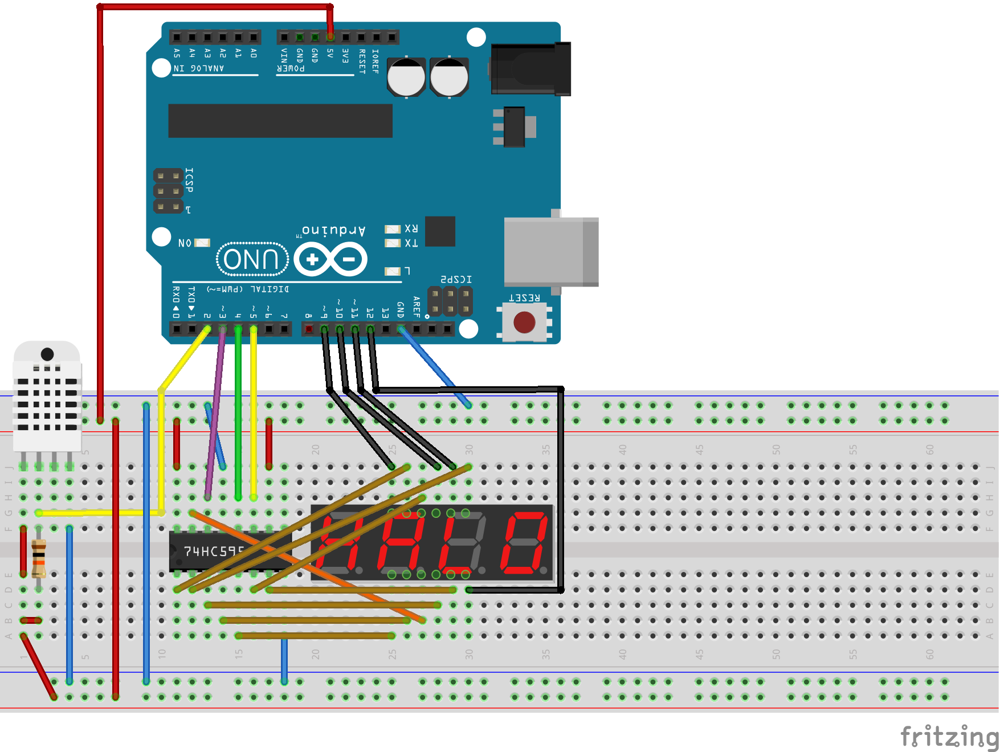

Temperature and Humidity Sensor
===============================

Arduino with a temperature and humidity sensor (DHT22) attached to it.

This project is best used with PlatformIO (`brew install platformio`). With that you should just do `pio run --target upload`.
